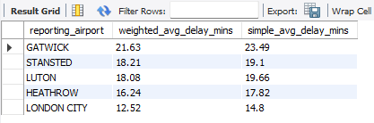
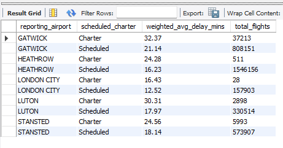
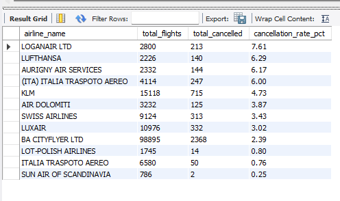

# London Airport and Airline Performance Dashboard

**Industry:** Aviation and Transport
**Data period:** January 2023 to April 2026

> A note on the data: every figure in this project comes from real, publicly released data from the UK Civil Aviation Authority, covering punctuality across five London airports over 40 consecutive months. Nothing here is simulated or estimated. Every number quoted in this README was checked directly against the underlying SQL output before being written down, and the two headline findings were tested a second time to make sure they held up under closer scrutiny.

**Why this project is here:** most portfolio dashboards report that a busy airport is a delayed airport and stop there. This one checked that assumption against 40 months of real CAA data and found the opposite in places. Gatwick, only the second busiest airport, has the worst average delay of the five, while London City, the smallest, has both the lowest average delay and the worst cancellation rate. Rather than publishing those two findings as they first appeared, both were tested a second time against a more careful method, and both held up. The full pipeline runs Python through MySQL to a fully interactive Tableau dashboard, including a genuine world map of every route out of London built on real coordinates, where clicking a route filters the table beneath it, and a dedicated search page for looking up any airline, origin, or destination directly.

**[View the live, interactive dashboard on Tableau Public](https://public.tableau.com/app/profile/sana.aziz/viz/LondonAirportsUKAirlinesPerformanceDashboard/AirportPerformance)**, no download or Tableau licence needed, opens directly in your browser.

---

## Dashboard Preview


---

## TL;DR

A five page Tableau dashboard analysing over 100,000 real CAA punctuality records across five London airports and hundreds of airlines, built on a dataset cleaned and merged in Python, explored through SQL window functions, and finished as a fully interactive dashboard, including a global flight route map built on real world coordinates and a dedicated route search page.

**Key findings:**

- Heathrow dominates London air traffic, 1,546,667 flights over the period, nearly double Gatwick's 845,364, and more than the other four airports combined
- Heathrow also holds 9 of the top 10 busiest individual routes out of London, led by Heathrow to New York JFK at 49,417 flights
- Punctuality is not simply a long haul versus short haul story. Some long haul carriers, Tunisair at 48.9 minutes and Air India at 38.0 minutes, show the worst average delays, while other long haul airlines, JetBlue at 9.0 minutes and Japan Airlines at 9.7 minutes, rank among the most punctual. The pattern is airline specific, not distance based
- Growth since 2023 has been uneven across airports. Luton shows the strongest, most consistent growth, up 2.6 per cent in 2024 and up 3.1 per cent in 2025, while London City has stayed essentially flat
- Gatwick has the worst average delay of any London airport, and this holds true even once the figure is weighted properly by flight volume, and even once scheduled flights are looked at on their own, separate from charter flights
- London City has the worst cancellation rate of any London airport, despite the lowest average delay, and this is not the result of one underperforming airline. Its largest operator by far actually cancels less often than the airport average

---

## Project Files

| File | Description | Link |
|---|---|---|
| Raw data | Original, unmodified monthly CAA punctuality exports | [Raw data folder](./Raw%20data) |
| Python cleaning and merging | Combines 40 monthly CAA exports, filters to the 5 London airports, standardises dates and labels, and handles a mixed file encoding issue | [london_airports_clean.ipynb](./london_airports_clean.ipynb) |
| Cleaned dataset | The final cleaned CSV output, also loaded into MySQL as `fact_punctuality` | [london_airports_clean.csv](./london_airports_clean.csv) |
| SQL queries | All business question queries used to answer the dashboard's core questions, including two follow up checks that test the headline findings before they are trusted | [london_airports_analysis_sql.sql](./london_airports_analysis_sql.sql) |
| Tableau dashboard | Full five page .twbx file, open in Tableau Desktop or Tableau Public to explore | [london_airports.twbx](./london_airports.twbx) |

---

## Why I Built This Project

Flight delays are something almost every UK traveller has an opinion on, usually formed from a single bad experience at one airport rather than from any real look at the data behind it. I wanted to test that gut feeling properly, using real CAA punctuality figures rather than anecdote, and answer a specific question. Is delay really about distance, about which airport you fly from, or is it something else entirely?

I built this around all five London airports and 40 months of data, rather than a single quarter or a single airport, so the project could show genuine year on year movement rather than a snapshot. What came out the other side was more interesting than expected. The busiest airport is not the least reliable one, the worst delays are not confined to long haul flights, and a small airport with the lowest average delay can still have the worst cancellation rate of the lot.

The most useful part of this project, though, was not stopping at the first version of those findings. Gatwick's poor delay figure and London City's poor cancellation figure were both the kind of clean, quotable result that is tempting to publish straight away. Instead, both were tested a second time against a more careful method before being written up as fact, and the goal throughout was to give an honest account of what the data actually shows, including the parts that did not match my first assumption, rather than force a tidy story onto the numbers.

---

## Project Overview

A data analysis project looking at flight punctuality, cancellations, and route demand across five London airports between January 2023 and April 2026. Built for a portfolio piece using real CAA open data, working through the full pipeline, raw data, Python cleaning, MySQL, SQL analysis, and a five page interactive Tableau dashboard.

The project covers **over 100,000 punctuality records** across **5 London airports**, **hundreds of airlines**, and **thousands of individual routes**, spanning 40 consecutive months.

The core question is what actually drives delay and cancellation at London's airports. Size, distance, or something more specific to each airline and airport. The honest answer is that it depends far more on the individual airline and airport than on any single obvious factor like flight distance, and that answer held up even after checking it twice.

---

## Insights

#### Datasets

- Raw datasets can be found in the `Raw data` folder
- The cleaned, merged dataset, `london_airports_clean.csv`, is produced by the Python notebook below and loaded directly into MySQL as `fact_punctuality`

#### Data Cleaning and Analysis

- The full Python cleaning and merging work is in [london_airports_clean.ipynb](./london_airports_clean.ipynb)
- The SQL queries used to answer all business questions, including the two follow up checks, are in [london_airports_analysis_sql.sql](./london_airports_analysis_sql.sql)
- The finished five page Tableau dashboard can be found in this repository as a .twbx file

---

## Tools and Technologies

| Category | Tools |
|---|---|
| Programming and cleaning | Python (Pandas), Jupyter Notebook |
| Database management | MySQL, SQLAlchemy, PyMySQL |
| Visualisation and reporting | Tableau, including Mapbox powered geographic mapping |
| Data storage | CSV files |
| Version control | GitHub |

---

## Project Phases

---

### Phase 1: Data Collection

Source data was taken directly from the CAA's monthly Punctuality Statistics releases, Full Analysis, Arrival and Departure. Forty separate monthly files were downloaded covering the full period.

- **Airport filter:** the 5 London airports, Heathrow, Gatwick, Stansted, Luton, and London City
- **Time range:** January 2023 to April 2026, 40 consecutive monthly files
- **Collection method:** each monthly file was downloaded directly from the CAA's open data portal in its native format, then combined into one notebook for cleaning and merging

This produced 40 raw monthly CSV files, `202301_Punctuality_Statistics_Full_Analysis_Arrival_Departure.csv` through to the most recent month, sitting in the `Raw data` folder in this repository, each a genuine, unmodified government export covering every UK reporting airport rather than only the London five.

---

### Phase 2: Data Cleaning and Merging (Python and Pandas)

**Notebook:** [london_airports_clean.ipynb](./london_airports_clean.ipynb)

Before any analysis, the raw monthly exports needed real cleaning. Each file covered every reporting airport in the UK, not just London, stored its dates as a plain year and month number rather than a proper date, and used single letter codes for arrival versus departure and scheduled versus charter flights.

**Filtering down to the five London airports and fixing the date column**


The `reporting_airport` column was filtered down to just Heathrow, Gatwick, Stansted, Luton, and London City, since the raw file covers every UK reporting airport by default. The `reporting_period` column arrived as a plain number in `YYYYMM` format rather than a real date, so it was converted using `pandas.to_datetime()` with an explicit format string.

**Finding and looping through all 40 monthly files**


Rather than repeating the cleaning steps by hand 40 times, `glob` was used to collect every matching monthly filename automatically, with the loop first tested on two files before being run against the full set of 40.

**Catching a mixed file encoding issue**


Running the loop against all 40 files failed part way through on the July 2023 file. Most of the CAA's monthly files are saved in standard UTF 8 text encoding, but this one file had evidently been opened and resaved in Excel at some point, which had quietly changed its encoding. Reading it with `latin1` encoding instead solved the problem for that one file.

**Building a loop that handles both encodings automatically**


Rather than manually tracking which of the 40 files needed which encoding, the loop was rewritten to try `utf-8-sig` first for every file, and automatically fall back to `latin1` only if that failed, so the cleaning process handled the encoding issue itself, file by file, without needing every file checked by hand.

A missing value check was run across every column before export, confirming the cleaned dataset was complete and ready for MySQL.

**Loading into MySQL**


The cleaned dataframe was loaded into a local MySQL database, `london_airports_project`, using `pandas.to_sql()` with `sqlalchemy` and `pymysql`. Row count in MySQL matched the cleaned CSV exactly, 100,728 rows.

Final cleaned dataset: **100,728 rows**, covering 40 months, 5 airports, and hundreds of airlines and routes, exported as `london_airports_clean.csv` and loaded directly into MySQL as the `fact_punctuality` table.

---

### Phase 3: Exploratory Data Analysis (SQL)

**Queries:** [london_airports_analysis_sql.sql](./london_airports_analysis_sql.sql)

Each query below was written to answer a specific business question, and every result was cross checked directly against the Tableau dashboard before being finalised.

---

**Business question: How many flights happened at each London airport?**

```sql
SELECT
    reporting_airport,
    SUM(number_flights_matched) AS total_flights
FROM fact_punctuality
GROUP BY reporting_airport
ORDER BY total_flights DESC;
```


Heathrow leads by a wide margin, 1,546,667 flights over the full period, nearly double Gatwick's 845,364, and more than Stansted, Luton, and London City combined.

---

**Business question: Is the average delay figure misleading if it is not weighted by flight volume?**

Every query above this point uses a simple `AVG()` across route level rows, which gives every row equal weight regardless of how many actual flights it represents. Before trusting any delay ranking, it is worth checking whether weighting by flight volume changes the picture.

```sql
SELECT
    reporting_airport,
    ROUND(SUM(average_delay_mins * number_flights_matched) / SUM(number_flights_matched), 2) AS weighted_avg_delay_mins,
    ROUND(AVG(average_delay_mins), 2) AS simple_avg_delay_mins
FROM fact_punctuality
WHERE number_flights_matched > 0
GROUP BY reporting_airport
ORDER BY weighted_avg_delay_mins DESC;
```



Gatwick and London City hold their positions at the top and bottom either way, at 21.63 minutes and 12.52 minutes weighted. However the ranking of second and third place actually flips depending on which method is used. Stansted overtakes Luton once the figures are weighted by flight volume, 18.21 minutes against 18.08 minutes, the opposite of the order a simple average would suggest. This is exactly the kind of thing worth checking before quoting a delay ranking as fact, and it is why the weighted figure is used throughout the rest of this project.

---

**Business question: Which airline has the worst average delay across London airports?**

```sql
SELECT
    airline_name,
    SUM(number_flights_matched) AS total_flights,
    ROUND(AVG(average_delay_mins), 1) AS avg_delay_mins
FROM fact_punctuality
WHERE number_flights_matched > 0
GROUP BY airline_name
HAVING SUM(number_flights_matched) > 500
ORDER BY avg_delay_mins DESC
LIMIT 10;
```


Tunisair tops the list at 48.9 minutes average delay, followed by Rwandair Express at 47.8 minutes and Air India at 38.0 minutes. The `HAVING` clause filtering out any airline with fewer than 500 matched flights matters here, since a handful of very low volume airlines would otherwise post extreme looking averages based on only a few flights.

---

**Business question: Which airlines are the most punctual, lowest average delay, operating from London airports?**

```sql
SELECT
    airline_name,
    SUM(number_flights_matched) AS total_flights,
    ROUND(AVG(average_delay_mins), 1) AS avg_delay_mins
FROM fact_punctuality
WHERE number_flights_matched > 0
GROUP BY airline_name
HAVING SUM(number_flights_matched) > 500
ORDER BY avg_delay_mins ASC
LIMIT 10;
```


KM Malta Airlines leads at just 4.3 minutes average delay, with JetBlue at 9.0 minutes and Japan Airlines at 9.7 minutes also in the top group. Both JetBlue and Japan Airlines are long haul carriers, sitting alongside short haul European airlines at the punctual end of the list, which is the clearest evidence in this project that punctuality is airline specific rather than a simple function of flight distance.

---

**Business question: What is the busiest route, origin airport to destination, overall?**

```sql
SELECT
    reporting_airport AS origin,
    origin_destination AS destination,
    SUM(number_flights_matched) AS total_flights
FROM fact_punctuality
GROUP BY origin, destination
ORDER BY total_flights DESC
LIMIT 10;
```


Heathrow to New York JFK tops the list at 49,417 flights, and Heathrow holds 9 of the top 10 busiest individual routes out of London overall.

---

**Business question: Is there a difference in cancellation rate between scheduled and charter flights?**

```sql
SELECT
    scheduled_charter,
    SUM(number_flights_matched) AS total_flights,
    SUM(number_flights_cancelled) AS total_cancelled,
    ROUND(SUM(number_flights_cancelled) / SUM(number_flights_matched) * 100, 2) AS cancellation_rate_pct
FROM fact_punctuality
GROUP BY scheduled_charter;
```


Scheduled and charter flights are compared directly on cancellation rate, giving a clean answer to whether the flight type itself, rather than the airport or airline, plays a meaningful role in cancellations.

---

**Business question: Is Gatwick's delay actually driven by charter mix, or does it hold within scheduled flights too?**

Gatwick's overall delay figure could simply reflect the fact that it handles far more charter traffic than Heathrow, and charter flights tend to run later everywhere. Before accepting the Gatwick finding as genuine, this needed to be ruled out.

```sql
SELECT
    reporting_airport,
    scheduled_charter,
    ROUND(SUM(average_delay_mins * number_flights_matched) / SUM(number_flights_matched), 2) AS weighted_avg_delay_mins,
    SUM(number_flights_matched) AS total_flights
FROM fact_punctuality
WHERE number_flights_matched > 0
GROUP BY reporting_airport, scheduled_charter
ORDER BY reporting_airport, scheduled_charter;
```



Gatwick does carry far more charter traffic than Heathrow, 37,213 flights against Heathrow's 511, and charter flights are indeed slower everywhere. But that is not what is driving the gap. Gatwick's scheduled flights alone average 21.14 minutes, still worse than Heathrow's scheduled average of 16.23 minutes. Gatwick loses to Heathrow even once charter flights are removed from the comparison entirely, which confirms the original finding is genuine rather than a side effect of Gatwick simply running more charter flights than Heathrow does.

---

**Business question: How did each airport's flight volume change year on year, from 2023 through to 2025?**

```sql
SELECT
    reporting_airport,
    flight_year,
    total_flights,
    LAG(total_flights) OVER (PARTITION BY reporting_airport ORDER BY flight_year) AS previous_year_flights,
    ROUND(
        (total_flights - LAG(total_flights) OVER (PARTITION BY reporting_airport ORDER BY flight_year))
        / LAG(total_flights) OVER (PARTITION BY reporting_airport ORDER BY flight_year) * 100
    , 1) AS yoy_pct_change
FROM (
    SELECT
        reporting_airport,
        YEAR(reporting_period) AS flight_year,
        SUM(number_flights_matched) AS total_flights
    FROM fact_punctuality
    GROUP BY reporting_airport, flight_year
) AS yearly_totals
ORDER BY reporting_airport, flight_year;
```


This uses a window function, `LAG()`, partitioned by airport, to compare each airport's flight volume against its own previous year, rather than needing a manual self join. Luton shows the strongest, most consistent growth, up 2.6 per cent in 2024 and up 3.1 per cent in 2025, while Heathrow and Gatwick grew initially but plateaued by 2025, and London City has stayed essentially flat throughout. 2026 figures only cover part of the year, so any comparison involving 2026 is not directly comparable to a full prior year.

---

**Business question: Is London City's high cancellation rate caused by one underperforming airline, or is it spread across the whole airport?**

London City's cancellation rate is the worst of any London airport, but that headline figure on its own does not say whether it is a genuine airport wide pattern or simply one poorly performing airline dragging the average up.

```sql
SELECT
    airline_name,
    SUM(number_flights_matched) AS total_flights,
    SUM(number_flights_cancelled) AS total_cancelled,
    ROUND(SUM(number_flights_cancelled) / SUM(number_flights_matched) * 100, 2) AS cancellation_rate_pct
FROM fact_punctuality
WHERE reporting_airport = 'LONDON CITY' AND number_flights_matched > 0
GROUP BY airline_name
HAVING SUM(number_flights_matched) > 500
ORDER BY cancellation_rate_pct DESC;
```



BA CityFlyer, London City's largest operator by a wide margin at 98,895 flights, more than every other airline at the airport put together, actually has a below average cancellation rate of 2.39 per cent against the airport's overall figure of 2.95 per cent. The higher cancellation rates instead come from a spread of smaller regional carriers, Loganair at 7.61 per cent, Lufthansa at 6.29 per cent, and Aurigny Air Services at 6.17 per cent. This confirms London City's cancellation problem is genuinely airport wide rather than the result of one underperforming airline.

---

### Phase 4: Advanced Analysis and Interactive Dashboard Design (Tableau)

Moved into Tableau for the interactive, geographically mapped dashboard work. All screenshots are in the `images` folder. Every page shares the same maroon and gold theme and the same left hand sidebar navigation, so the whole dashboard feels like one connected report rather than five separate charts.

---

## Page 1: Home


The landing page of the dashboard, giving a plain description of what each of the four following pages actually shows before the reader clicks into any of them. Airline Performance covers average delay and cancellation rate by airline. Airport Performance covers total flights, cancellations, and delay across the five London airports. Route Map shows the busiest flight routes on a world map. Route Search lets a reader look up punctuality for a specific airline, origin, or destination.

**Page outcome:** this page orients a first time reader before they touch anything, and sets the maroon, gold, and cream colour language carried through every other page.

---

## Page 2: Airline Performance


This page moves the focus onto individual airlines rather than airports, comparing punctuality, cancellations, and route coverage side by side.

**Airlines by average delay, best to worst, and worst to best** Two ranked bar charts sitting side by side, KM Malta Airlines, Sun Air of Scandinavia, and Fly Play at the punctual end, Tunisair, Rwandair Express, and Air India at the other. Both charts share the same 500 flight minimum used in the SQL, so a low volume airline cannot appear at either extreme purely by chance.

**Top 5 airlines by total flights, donut chart** British Airways dominates by a wide margin at 810,617 flights, more than EasyJet, Ryanair, BA CityFlyer, and Wizz Air combined.

**Total aircraft movements, table** Arrivals and departures listed side by side for every major airline, British Airways leading at just over 404,000 arrivals and 405,000 departures.

**Total countries served from UK, bar chart** BA Euroflyer, trading as British Airways, and BA CityFlyer both serve over 20 countries from the UK, more than any other airline in the dataset.

**Total routes served from UK, bar chart** British Airways again leads at 244 distinct routes, followed by Ryanair at 208 and EasyJet at 171.

**Page outcome:** this page shows that a small number of large airlines, led by British Airways, dominate London's air network by both volume and reach, while punctuality itself does not follow the same pattern. The most and least punctual airlines are a genuine mix of long haul and short haul carriers.

---

## Page 3: Airport Performance


This page shifts the focus onto the five London airports themselves, covering total flights, cancellations, and delay side by side.

**KPI cards** Three headline figures at the top of the page, 3,463,274 total flights, 48,872 total cancellations, and a 1.41 per cent cancellation rate across the whole dataset.

**Total routes flown and airport bubbles, bubble charts** Two circle packed views, one showing route count per airport, Gatwick leading at 400 distinct routes, and the other showing total flight volume, Heathrow dominating at 1,546,667.

**Cancellation rate by airport, bar chart** London City has the worst cancellation rate of any London airport, 2.96 per cent, more than double Heathrow's 1.75 per cent, despite being the smallest airport in the dataset by volume, and shown in the SQL analysis above to be a genuinely airport wide pattern rather than one airline's fault.

**Average delay by airport, bar chart** Gatwick has the worst average delay, ahead of Stansted and Luton, despite Gatwick being only the second largest airport by volume, a finding checked twice in the SQL analysis above and confirmed both times. London City has the lowest average delay of the five.

**Delayed 2 to 3 hours, and delayed 3 or more hours, bar charts** Two further breakdowns showing how each airport's delay profile changes at the more severe end, Gatwick again leading on both measures.

**Page outcome:** this page shows that airport size and reliability do not move together in a simple way. Gatwick, the second busiest airport, has the worst average delay of the five, while London City, the smallest, has both the lowest average delay and the worst cancellation rate, a genuinely counterintuitive pairing that only shows up once cancellations and delay are looked at separately rather than as one combined reliability score, and one that held up under closer checking rather than falling apart.

---

## Page 4: Route Map


This page is the dashboard's centrepiece, a genuine world map plotting every route flown out of the five London airports, built using Tableau's `MAKEPOINT()` and `MAKELINE()` calculated fields against a real airport coordinate lookup file, rather than a simplified schematic diagram.

**Airline destinations map** Every route drawn as a curved line from its London origin airport to its real world destination, colour coded by reporting airport, Gatwick in gold, Heathrow in maroon, Stansted in green, Luton in pink, and London City in grey. Clicking any single route highlights it directly on the map and filters the table underneath to that route alone, and clicking a second route while holding the selection adds it alongside the first, letting two routes be compared side by side directly, as shown in the screenshot above.

**Punctuality by route, table** A full delay bucket breakdown, from 15 minutes early through to 360 or more minutes late, for whichever route or routes are currently selected on the map. Rather than leaving every single route stacked in one long unfiltered scroll, the dashboard is published with two solid, high volume routes preselected by default, Gatwick to Las Vegas and Heathrow to Seoul Incheon, both showing a normal, sensible looking delay distribution rather than a route with too few flights to be meaningful.

**Page outcome:** this page turns a table that would otherwise be hundreds of routes deep into something genuinely explorable, and the preselected default view demonstrates the click to filter interaction immediately, without needing a reader to click anything themselves first.

---

## Page 5: Route Search


The final page reuses the same map and table structure as Route Map, but is built specifically to let a reader search by a particular airline, origin airport, or destination, rather than only clicking directly on the map.

**Route search map and route search results** The same style of world map and delay bucket table as page four, but wired to a dedicated filter panel behind the funnel icon in the sidebar, built from the same three fields, reporting airport, airline name, and destination. Clicking the funnel icon reveals the search panel as a floating overlay, letting a reader filter to a specific airline or destination directly, rather than only being able to click a route that is already visible on the map.

**Page outcome:** this page is the dashboard's dedicated lookup tool, built for a reader who already knows which airline or destination they want to check, rather than one who is browsing the map for something interesting.

---

## Skills This Project Demonstrates

- End to end data pipeline construction, from 40 separate monthly government exports, through Python cleaning and merging, MySQL loading, SQL analysis, and finally an interactive Tableau dashboard
- Real world file handling, including catching and correctly resolving a mixed file encoding issue across 40 files without needing to check each one by hand
- Testing a headline finding before publishing it, rather than after. Both the Gatwick delay finding and the London City cancellation finding were checked a second time against a more careful method once they first appeared, and both were confirmed rather than assumed
- Recognising a subtle measurement issue, that a simple average across route level rows can rank airports differently to a flight volume weighted average, and correcting for it before drawing conclusions
- SQL query writing across aggregation, grouping, and window functions, including `LAG()` partitioned by airport for year on year change detection, and a `HAVING` clause used specifically to prevent low volume airlines from distorting a delay ranking
- Geographic data visualisation in Tableau, building a genuine world map of flight routes using `MAKEPOINT()` and `MAKELINE()` calculated fields against a real coordinate lookup file, rather than a simplified diagram
- Dashboard interactivity design, including click based cross filtering on the map, a dedicated hidden and revealed filter panel behind a toggle button, and a deliberately chosen default selection state to avoid an unreadable, unfiltered table on first load
- Translating raw statistics into plain English findings, including being willing to highlight a counterintuitive result, Gatwick's high average delay and London City's high cancellation rate, rather than only reporting the findings that confirm an obvious assumption

---

## Key Findings

Start with the sheer scale of what five airports actually handle. Over 40 months, London's five airports recorded well over three million flights between them, and that total is not spread evenly. Heathrow alone accounts for 1,546,667 of them, nearly double Gatwick's 845,364, and genuinely more than Stansted, Luton, and London City combined. Heathrow also holds 9 of the top 10 busiest individual routes out of London, led by the run to New York JFK at 49,417 flights over the period. If you only looked at this one number, the obvious next assumption would be that Heathrow, as the biggest and busiest, must also be under the most strain, and therefore the least reliable. That assumption turns out to be wrong, and it is wrong in a genuinely interesting way.

The airport that struggles most with delay is not the one carrying the most traffic. Gatwick, the second busiest airport by a clear margin, has the worst average delay of all five. This was not simply accepted at face value either. Two obvious explanations were tested and ruled out. First, whether a simple, unweighted average was distorting the picture. It was not, Gatwick's delay disadvantage holds up once the figure is properly weighted by flight volume. Second, whether Gatwick's larger share of charter flights, which run later everywhere, was doing the work instead of Gatwick itself. It was not, Gatwick's scheduled flights alone still average a slower delay than Heathrow's scheduled flights. Heathrow, despite handling nearly double Gatwick's volume, posts a genuinely lower average delay than Gatwick does, and that gap survives every check that was thrown at it.

Then London City complicates the story again, but in the opposite direction. London City has the lowest average delay of any of the five airports, which on its own would suggest it is the most reliable airport in London. But it also has, by a wide margin, the worst cancellation rate of the five. The obvious next question was whether this was really an airport wide pattern or simply one badly performing airline pulling the average up. It is not one airline. BA CityFlyer, London City's largest operator by a wide margin, actually cancels less often than the airport average. The higher cancellation rates instead come from a spread of smaller regional carriers. Put those two numbers side by side and a genuinely useful pattern emerges. London City appears to resolve disruption differently to the larger airports. Rather than letting a flight run late and absorbing the delay, as Heathrow and Gatwick more often do given their scale and slot flexibility, London City looks more likely to cancel a flight outright, and this looks like a genuine airport wide operating pattern rather than a single carrier's problem.

So is punctuality really just a function of how far a flight has to travel? The instinctive assumption is that long haul flights, crossing time zones and weather systems, are naturally more prone to delay than a short hop to Europe. The airline level data does not support that as a general rule. Tunisair, at 48.9 minutes average delay, and Air India, at 38.0 minutes, do sit at the poor end of the punctuality table, and both are long haul carriers. But JetBlue, at just 9.0 minutes, and Japan Airlines, at 9.7 minutes, both also long haul, sit comfortably in the most punctual group in the whole dataset, alongside short haul European airlines. Distance alone clearly is not the deciding factor. Whatever separates a punctual airline from an unpunctual one, it is something specific to that airline's own operations, scheduling discipline, and ground handling, not simply how far its aircraft happen to be flying.

Growth across the network has not been even either, and one airport stands out for a different reason entirely. Luton shows the strongest, most consistent growth of any London airport across the period covered, up 2.6 per cent in 2024 and a further 3.1 per cent in 2025, a steady upward trajectory rather than a single good year. Heathrow and Gatwick both grew initially but had plateaued by 2025, suggesting they may be approaching a natural ceiling given existing runway and slot constraints. London City, meanwhile, has stayed essentially flat throughout the whole period, showing very little growth in either direction since 2023. Three very different growth stories sitting under the same London airport label.

And running underneath all of this is a genuinely reassuring seasonal pattern. Every year from 2023 to 2025 shows the same shape, a clear summer peak in July and a winter trough, and each year's summer peak has landed slightly higher than the one before it. That consistency matters, because it means the growth seen elsewhere in this dataset is not a one off spike or an artefact of how the data happens to be measured. It is a steady, repeating pattern of recovery and growth in London's air travel demand, year after year, which gives real weight to the airport level findings sitting above it.

---

## Recommendations

Investigate what specifically is driving Gatwick's average delay, now that the two most obvious explanations, an unweighted average and a heavier charter mix, have both been ruled out. Runway capacity and schedule spacing at Gatwick itself would be reasonable next steps, since the gap against Heathrow persists even after controlling for both.

Look separately at London City's cancellation policy versus its delay handling. The combination of the lowest average delay and the highest cancellation rate in London, confirmed to be a genuine airport wide pattern rather than one airline's fault, suggests a genuinely different operational approach to disruption, cancel early rather than run late. This is worth understanding on its own terms rather than folding into a single reliability score that would hide the pattern entirely.

Treat airline punctuality as an airline specific issue, not a route or distance based one, when deciding where to focus reliability improvements. Since JetBlue and Japan Airlines prove long haul flights can be highly punctual, the airlines sitting at the poor end of the table, such as Tunisair and Air India, likely have operational factors specific to their own scheduling and ground handling worth addressing directly.

Keep a close eye on Luton's growth trajectory for future capacity planning. Its consistent year on year growth, in contrast with Heathrow and Gatwick's plateau, suggests Luton may be the airport most likely to face genuine capacity pressure first if current trends continue, and is worth monitoring ahead of any infrastructure decisions.

---

## Limitations

- 2026 figures only cover part of the year, so any year on year comparison involving 2026 is not directly comparable to a full prior year
- Delay and cancellation are reported here as separate measures rather than combined into one single reliability score, which is a deliberate choice, since combining them would have hidden the genuinely interesting split between Gatwick's high delay and London City's high cancellation rate
- Airline level delay figures are shown only for airlines above a 500 flight minimum, in line with the SQL analysis, so a small number of very low volume airlines are excluded from the punctuality rankings entirely rather than shown with an unreliable average
- Route coordinates come from a separate airport lookup file joined against the main dataset, so any route to an airport missing from that lookup file would not currently render correctly on the map
- The two follow up checks in this project tested whether a weighting issue or a charter mix issue explained the Gatwick and London City findings. Other explanations, such as weather patterns specific to each airport's location or differences in runway layout, were not tested here and would need data outside this project's scope

---

## What Could Be Added With More Time

- A dedicated delay cause breakdown, if that level of detail becomes available from the CAA, to move beyond how much delay happened towards why
- A combined reliability score view, sitting alongside the current separate delay and cancellation views, for a reader who wants one single ranking rather than two
- Extending the route map to filter by season, to test whether the summer peak identified in the SQL analysis is driven by particular routes or airlines rather than the network as a whole
- A time of day breakdown of Gatwick's delay, to see whether it is concentrated in particular hours rather than spread evenly across the day

---

## Data Source

UK Civil Aviation Authority, [Punctuality Statistics, Full Analysis, Arrival and Departure](https://www.caa.co.uk/data-and-analysis/uk-aviation-market/flight-reliability-and-punctuality/), Open Government Licence.

---

## About Me

I built this dashboard as part of my own practice in data analysis and business intelligence, with a particular interest in transport and aviation data. I am currently looking for opportunities in London within data analysis or business intelligence roles, and I would welcome the chance to talk through this project, the choices behind it, or any part of the underlying data model.

Feel free to open the .twbx file yourself, explore the dashboard, and reach out with any questions or feedback.

---

## Contact

**Sana Aziz**

Data Analyst | SQL, Excel, Power BI, Tableau, Python

London, UK
[LinkedIn](https://www.linkedin.com/in/sana-aziz-analyst-uk/)
